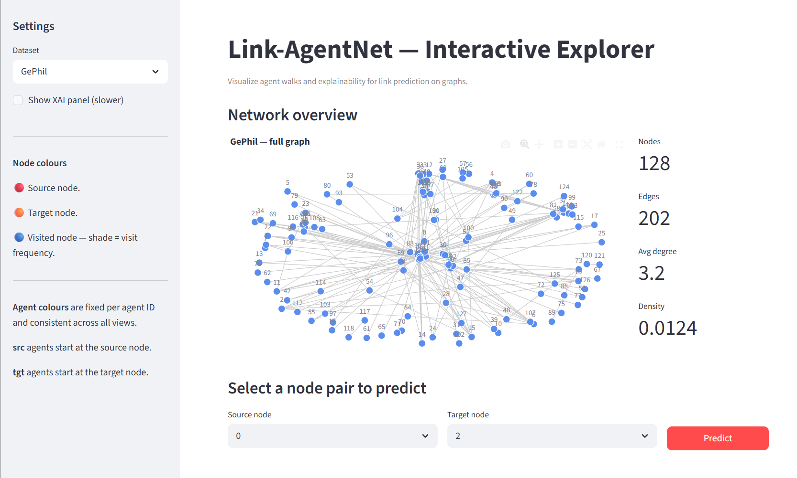
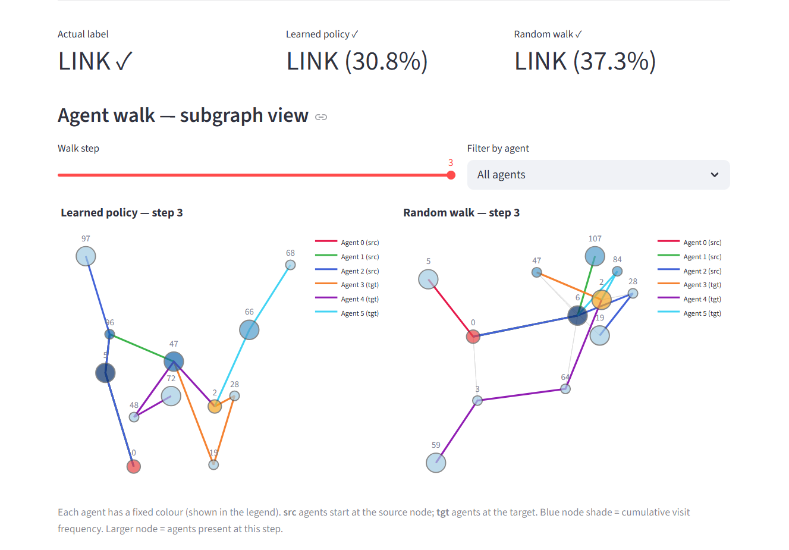
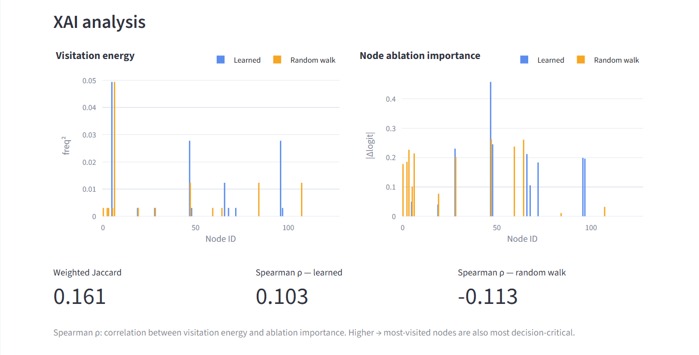

# Link-AgentNet

**Towards Agent-Based Explanations for Link Prediction** - Bachelor's Thesis

This project adapts the [AgentNet](https://github.com/KarolisMart/AgentNet) architecture (Martinkus et al., 2023) to the **link prediction** task. Instead of classifying whole graphs, autonomous agents traverse k-hop subgraphs extracted around node pairs and vote on whether an edge exists. Since we can retrieve agent paths, the model is inherently interpretable: we can compare the learned policy against a random-walk baseline using node ablation and visitation energy.

Two datasets are included:

| Dataset | Nodes | Edges | Description |
|---------|-------|-------|-------------|
| **KarateLink** | 34 | 78 | Zachary's Karate Club - small, classic benchmark |
| **GePhilNet** | 128 | 202 | Geneva Philanthropic Network - real-world foundation board memberships and financial transactions |

---

## Installation

```bash
# Create and activate a Python 3.9+ environment
conda create -n link-agentnet python=3.10
conda activate link-agentnet

# Install PyTorch (adjust CUDA version as needed, tested with torch 2.1 + cu121)
pip install torch --index-url https://download.pytorch.org/whl/cu121

# Install PyTorch Geometric and its sparse backends
pip install torch-scatter torch-sparse torch-geometric \
    -f https://data.pyg.org/whl/torch-2.1.0+cu121.html

# Install remaining dependencies
pip install -r requirements.txt
```

---

## Repository structure

```
├── out/
│   ├── checkpoints/               # Best-epoch model weights for each dataset
│   ├── datasets_splits/           # Pre-built graphs + stratified splits (.pkl)
│   ├── optuna_db/                 # Optuna hyperparameter search databases
│   ├── KarateLink_output.zip      # Per-epoch training metrics (unzip to use analyze.py)
│   └── GePhil_output.zip          # Per-epoch training metrics (unzip to use analyze.py)
└── src/
    ├── model.py                   # LinkPredictionAgentNet implementation
    ├── util.py                    # LinkPredictionDataset + training utilities
    ├── link_prediction.py         # Training & evaluation pipeline (CLI)
    ├── analyze.py                 # Explainability analysis (CLI)
    ├── app.py                     # Interactive Streamlit explorer
    ├── build_networks.ipynb       # Construct graphs from raw CSV data
    ├── optuna_hyperparameter_tuning.ipynb
    └── plots.ipynb                # Network visualizations & Optuna convergence
```

> **Checkpoints:** The best-performing model weights for each dataset are included in `out/checkpoints/` and are loaded automatically by the Streamlit app and the explainability script.

---

## Training

Run from the `src/` directory. All hyperparameters default to the Optuna-tuned best values; override any of them as needed.

```bash
cd src/

# Train on Karate Club (fast -> ~30 nodes, completes in a few minutes on CPU)
python link_prediction.py --dataset KarateLink

# Train on GePhil with recommended settings
python link_prediction.py --dataset GePhil --self_loops

# Run Optuna hyperparameter search instead of a single training run
python link_prediction.py --hyper
```

Key flags:

| Flag | Default | Description |
|------|---------|-------------|
| `--dataset` | `KarateLink` | `KarateLink` or `GePhil` |
| `--epochs` | `350` | Training epochs |
| `--num_agents` | `4` | Number of agents (must be even -> half start at source, half at target) |
| `--num_steps` | `8` | Walk steps per forward pass |
| `--hidden_units` | `64` | Hidden dimension |
| `--k_hop` | `3` | Subgraph radius around each node pair |
| `--random_agent` | off | Use random-walk policy instead of learned attention |
| `--verbose` | off | Print per-epoch timing and memory stats |
| `--hyper` | off | Run Optuna hyperparameter search instead of training |


---

## Explainability analysis (CLI)

Compares the learned agent policy against a random-walk baseline. For each test sample it computes per-node visitation energy, ablation importance, and Jaccard walk overlap, saving results to `out/<dataset>_output/learn_vs_rw.csv`.

```bash
cd src/
python analyze.py --dataset KarateLink
python analyze.py --dataset GePhil
```

The script prints F1/AUC scores and Wilcoxon signed-rank p-values comparing the two policies.

---

## Interactive explorer (Streamlit)

The Streamlit app lets you pick any node pair, watch agents traverse the subgraph step by step, and inspect explainability metrics without relying on code.

```bash
streamlit run src/app.py
```

The app automatically picks the best-performing model split. Features:
- Full network overview with node statistics
- Node-pair selector → learned policy vs. random-walk prediction with confidence
- Step-by-step agent walk on the k-hop subgraph, filterable per agent
- Optional XAI panel: per-node visitation energy, ablation importance, Jaccard walk overlap, and Spearman ρ between energy and importance







---

## Datasets

The pre-built graph objects for both datasets are included in `out/datasets_splits/` and are sufficient to run training, the Streamlit app, and the explainability analysis. The raw source data used to construct GePhilNet is not publicly distributed.

---

## Reference

This work extends the AgentNet model introduced in:

> Martinkus, K., Papp, P. A., Schesch, B., & Wattenhofer, R. (2023).  
> **Agent-Based Graph Neural Networks**.  
> *(ICLR 2023).*  
> [https://github.com/KarolisMart/AgentNet](https://github.com/KarolisMart/AgentNet)

The training pipeline additionally draws from:
- [DropGNN](https://github.com/KarolisMart/DropGNN/blob/main/gin-graph_classification.py)
- [Powerful GNNs](https://github.com/weihua916/powerful-gnns)
- [k-GNN examples](https://github.com/chrsmrrs/k-gnn/tree/master/examples)
